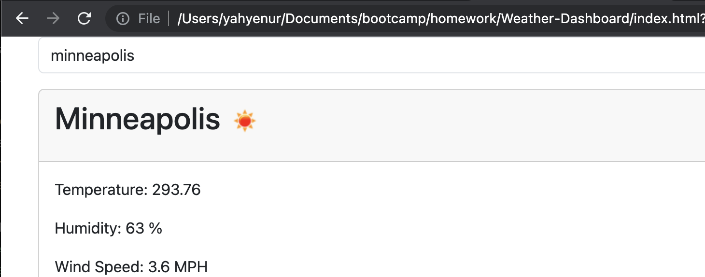

# Weather-Dashboard

## I will build a weather dashboard that will run in the browser and feature dynamically updated HTML and CSS.

- no instrution
- 
- (Deployed Link)[https://yamyam500.github.io/Weather-Dashboard/index.html]
